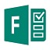

#### [About Me](./about)

# Software Experience
  This is a list of software applications that I have extensive experience with.

| Name                 | Logo |
|----------------------|------|
| __Microsoft__        |      |
| Microsoft Word       |      |
| Microsoft Excel      |      |
| Mircosoft PowerPoint |      |
| Microsoft SharePoint |      |
| Microsoft Flow       |      |
| Microsoft Teams      |      |
| Microsoft OneNote    |      |
| Microsoft Outlook    |      |
| Microsoft Forms      |      |
| __Google__           |      |
| Google Mail          |      |
| Google Drive         |      |
| Google Docs          |      |
| Google Sheets        |      |
| Google Slides        |      |
| __Other__            |      |
| Eclipse IDE          |      |
| Enthought Canopy IDE |      |
